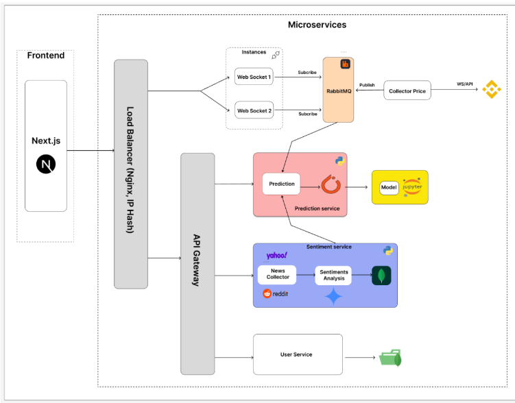

# USTrading 📈

[](https://github.com/HoangThanhMan/TradeUS/actions/workflows/ci.yml)

> **Trade Smarter, Not Harder** — A real-time cryptocurrency trading platform powered by AI-driven sentiment analysis, price prediction, and advanced backtesting.

---

## Table of Contents

- [Overview](#overview)
- [Features](#features)
- [Architecture](#architecture)
- [Tech Stack](#tech-stack)
- [Database Design](#database-design)
- [Design Patterns](#design-patterns)
- [Getting Started](#getting-started)
- [Services](#services)
- [Advanced Modules](#advanced-modules)
- [Team](#team)

---

## Overview

USTrading is a full-stack microservices-based trading platform built for cryptocurrency market analysis. It combines real-time price data streaming, machine learning price prediction, AI-powered sentiment analysis, and a comprehensive backtesting engine — all in a single, unified interface.

The system was designed to evolve through three architectural versions, scaling from a monolithic backend to a fully distributed microservices architecture with message broker, load balancing, and container orchestration.

🎬 [Watch Demo on YouTube](https://www.youtube.com/watch?v=X3NT7YbfFSU)

---

## Features

### 📊 Charts & Analysis
- **Single Chart** — Real-time candlestick/line/bar/area charts with live 1-second updates
- **Multi Chart** — Monitor 2–4 trading pairs simultaneously on one screen
- **Multi Timeframe** — View the same symbol across multiple timeframes (1s, 1m, 1h, 1d) side by side
- **Technical Indicators** — MA, EMA, SMA, BOLL, SAR, BBI, RSI, MACD, VOL and more
- **Drawing Tools** — Trendlines, Fibonacci Retracement, geometric shapes

### 🤖 AI-Powered Tools
- **Price Prediction** — LSTM-based ML model predicting next candle log return, with BUY/SELL/HOLD recommendation
- **Sentiment Analysis** — News classified into Optimism, Greed, Excitement, Fear, Anger, Pessimism with a continuous sentiment score (-1 to +1). Gemini is the default backend; a local RoBERTa encoder can be swapped in with `SENTIMENT_BACKEND=local`
- **AI Chatbot Assistant** — A tool-calling agent that answers market questions from live system data: it queries the prediction and sentiment services and retrieves real headlines from a vector index, then streams a grounded answer
- **News Feed** — Aggregated news from Yahoo Finance, CryptoNews, Reddit with AI-generated summaries and per-article sentiment scores

### 🧪 Backtesting
- Test strategies against historical OHLCV data from Binance
- Pre-built strategy templates: Moving Average Crossover, Bollinger Bands Bounce, RSI Overbought/Oversold, MACD Cross, Volume Breakout
- Custom strategy builder with multi-condition logic (SMA, EMA, Price, RSI, MACD, Bollinger Bands, Keltner Channel, candlestick patterns)
- AI-assisted signal filtering integrated into backtest engine
- Full trade history, win rate, P&L, and visual BUY/SELL/EXIT markers on chart

### 👤 User Management & VIP
- JWT-based authentication (login/register)
- Role-based access: Standard User, VIP Member, Administrator
- VIP subscription (Monthly / Yearly) with VietQR payment integration
- Admin dashboard to approve/reject VIP requests and configure QR payment settings
- Account management with password change and VIP membership details

---

## Architecture

The system evolved through three architectural versions:

### Version 1 — Monolith
Simple Next.js frontend communicating directly with a single backend server via API Gateway. Suitable for early development and small user counts.

### Version 2 — Microservices
System split into independent services: `User Service`, `Sentiment Service`, `Prediction Service`. Added API Gateway for routing. AI/ML tasks separated into Python-based services.

### Version 3 — Production-Ready (Current)



**Key architectural properties:**
- **Performance**: RabbitMQ async processing + Redis caching reduce DB load and latency
- **Scalability**: Each service scales independently; pub/sub allows new consumers without modifying publishers
- **Reliability**: Service isolation prevents cascading failures; RabbitMQ persists messages when consumers are unavailable

---

## Tech Stack

| Layer | Technology |
|---|---|
| Frontend | Next.js (React) |
| API Gateway | NestJS |
| User Service | NestJS + TypeScript |
| Sentiment Service | Python (FastAPI, Gemini API + optional local RoBERTa) |
| Prediction Service | Python (PyTorch LSTM, TorchScript) |
| Chat Agent Service | Python (FastAPI, Gemini function calling) |
| Message Broker | RabbitMQ |
| Primary Database | MongoDB (Mongoose) |
| Cache | Redis |
| Vector Database | Qdrant (news retrieval for the chat agent) |
| Load Balancer | Nginx (IP Hash) |
| Containerization | Docker + Docker Compose |
| Price Data Source | Binance WebSocket & REST API |
| News Sources | Yahoo Finance, CryptoNews, Reddit |
| AI / LLM | Gemini API (chat agent + sentiment), RoBERTa encoder (local sentiment backend) |
| Payment | VietQR |

---

## Database Design

The system uses **MongoDB** with five main collections:

### `users`
Stores user credentials, roles (`user`, `vip`, `admin`), and VIP subscription metadata (`vipStatus`, `vipPlan`, `vipExpiry`).

### `vip_requests`
Tracks VIP upgrade requests from users including payment plan, amount, and processing status (`PENDING`, `APPROVED`, `REJECTED`).

### `qr_configs`
Admin-managed bank account and QR template configuration for monthly/yearly VIP payment generation via VietQR.

### `collected_news`
Raw news articles scraped from external sources. Includes `metadata.analyzed` flag and reference to the corresponding sentiment record.

### `sentiments`
Stores AI-generated sentiment analysis results per article: numeric `sentiment` score, emotion label, affected trading `symbol`, and the model's `reason`.

### Indexes
```js
// Fast login lookups and duplicate checks
userSchema.index({ email: 1 });
userSchema.index({ username: 1 });

// Efficient news queries by source, sorted newest first
collectedNewsSchema.index({ source: 1, published_at: -1 });
```

---

## Design Patterns

| Pattern | Usage in USTrading |
|---|---|
| **Singleton** | `RedisService` — single shared Redis connection across the app |
| **Factory** | `PaymentFactory` — creates `MonthlyPayment` or `YearlyPayment` handler by type |
| **Dependency Injection** | NestJS `@Injectable()` — services receive dependencies via constructor |
| **Repository** | `UserRepository` — encapsulates all Mongoose CRUD; services never touch DB directly |
| **Observer / Pub-Sub** | `BinanceKlineClient` publishes kline events; consumers (storage, alerts, analysis) subscribe via callbacks |
| **Adapter** | `BinanceKlineAdapter` — normalizes raw Binance data into the unified `MarketKline` interface |
| **Builder** | `UserBuilder` / `PaymentBuilder` — fluent API for constructing complex objects step by step |
| **Template Method** | `PassportStrategy` base class; `JwtStrategy` and `LocalStrategy` implement only their specific `validate()` logic |
| **Strategy** | `CanActivate` interface with interchangeable guards: `JwtAuthGuard`, `RolesGuard`, `AdminGuard` |
| **Facade** | `AuthService` — exposes `login`, `register`, `refreshTokens`, `getProfile` while hiding JWT, hashing, and microservice calls |

---

## Getting Started

### Prerequisites
- Docker & Docker Compose
- Node.js 18+
- Python 3.10+

### Run the full stack

```bash
git clone https://github.com/your-org/ustrading.git
cd ustrading
docker-compose -f docker-compose.dev.yml up --build
```

This will spin up:
- MongoDB
- Redis
- RabbitMQ
- API Gateway (NestJS)
- User Service
- Collector Price Service
- Sentiment Service
- Prediction Service
- WebSocket Gateway (×2 instances)
- Nginx Load Balancer
- Next.js Frontend

### Environment Variables

Each service has its own `.env` file. Copy from the provided `.env.example`:

```bash
cp .env.example .env
```

Key variables:

```env
# API Gateway
JWT_SECRET=your_jwt_secret
JWT_REFRESH_EXPIRY=7d

# MongoDB
MONGO_URI=mongodb://localhost:27017/tradex

# Redis
REDIS_HOST=localhost
REDIS_PORT=6379

# RabbitMQ
RABBITMQ_URL=amqp://localhost:5672

# Gemini (AI Chatbot + embeddings)
GEMINI_API_KEY=your_gemini_api_key

# Chat agent (the /api/chatbot route proxies to this service)
CHAT_AGENT_SERVICE_URL=http://localhost:8006

# Qdrant (news retrieval index)
QDRANT_URL=http://localhost:6333

# Sentiment backend: gemini (default) | local
# `local` runs the RoBERTa encoder on CPU and needs no key. LOCAL_MODEL_VARIANT
# picks base (the public checkpoint, currently the more accurate one) or student
# (the LoRA fine-tune).
SENTIMENT_BACKEND=gemini
LOCAL_MODEL_VARIANT=base

# Binance
BINANCE_WS_URL=wss://stream.binance.com:9443
```

---

## Services

Ports are the ones published by `docker-compose.dev.yml`.

| Service | Port | Description |
|---|---|---|
| `nginx` | 80 | Load balancer and single entry point |
| `api-gateway` | 3001 | Central routing, auth, JWT validation |
| `user-service` | 3010 | User CRUD, VIP management, Redis caching |
| `collector-price` | — | Binance WebSocket listener, publishes to RabbitMQ |
| `sentiment-service` | 8001 | News collection + sentiment analysis (Gemini or local RoBERTa) |
| `prediction-service` | 8002 | LSTM model inference, RESTful prediction endpoint |
| `email-service` | 8003 | Consumes RabbitMQ events, sends alert mail |
| `symbol-alert-service` | 8004 | Consumes RabbitMQ alerts, stores to Redis |
| `symbol-subscription-service` | 8005 | Per-user symbol subscriptions |
| `chat-agent-service` | 8006 | Tool-calling market agent with news retrieval, SSE streaming |
| `ws-gateway-1/2` | 3002/3003 | WebSocket gateways behind Nginx load balancer |
| `qdrant` | 6333 | Vector index of news articles |
| `frontend` | 3000 | Next.js web app |

---

## Advanced Modules

### 🧠 Sentiment Analysis (Gemini + local RoBERTa)

Two interchangeable backends sit behind one API, selected with `SENTIMENT_BACKEND`:

- **`gemini`** *(default)* — Gemini classifies each article into one of six emotions (Optimism, Greed, Excitement, Fear, Anger, Pessimism), assigns a continuous score in `[-1, +1]`, and for high-volatility news identifies the affected trading pairs. Every stored document records which backend produced it, so an API outage can never be mistaken for a healthy pipeline.
- **`local`** — a RoBERTa encoder on CPU: no API key, no marginal cost, ~5x faster. Set `LOCAL_MODEL_VARIANT` to pick between two variants.

#### The RoBERTa fine-tune

`training/train_distill.py` distils the labels stored by the live pipeline into a small encoder — LoRA (rank 16, alpha 32, targeting `query`/`value`) over `mrm8488/distilroberta-finetuned-financial-news-sentiment-analysis`, with two heads trained jointly: MSE on the sentiment score and CrossEntropy on the emotion class.

**The result is negative, and the untrained checkpoint is the variant worth using.** All three systems below scored the same 50 hand-labelled articles:

| | `local` / `base`<br>(no training) | `local` / `student`<br>(LoRA fine-tune) | `gemini` path |
|---|---|---|---|
| Sentiment-bucket accuracy | **66.0%** | 58.0% | 56.0% |
| Emotion accuracy | n/a *(3-class)* | 28.0% | 24.0% |
| Mean latency / article | ~41 ms | 41 ms | 229 ms |
| Marginal cost / 1k articles | $0 | $0 | ~1350 input tokens each |

*(Majority-class floor: 36.0%. None of the 50 evaluation articles appear in the 140 training or 36 validation rows.)*

The LoRA pass **cost 8 points** against the checkpoint it started from — training on the current labels actively degraded a working model, which is why `student` is not the default and neither local variant is wired into production.

**The cause is the labels, not the method.** The Gemini API key was suspended before the training set was exported, so the 176 rows carry labels from the keyword fallback rather than from Gemini — the student learned to imitate a regex. Restoring the key and re-running `export_training_data` → `train_distill` → `evaluate_distill` is what turns this into a real distillation result; the bar it then has to clear is the 66.0% above.

Full write-up: [`training/report.md`](services/sentiment-service/training/report.md).

### 📉 Price Prediction (LSTM)
- Input features: OHLCV + technical indicators (RSI, MACD, Bollinger Bands) + sentiment score
- Target: Log Return (stabilizes time series, avoids large absolute price swings)
- Preprocessing: `RobustScaler` (IQR-based, resistant to pump/dump outliers)
- Sliding window: 24 past candles → predict 1 future candle
- Training: PyTorch + CUDA on Colab, Adam optimizer, MSE loss
- Deployment: TorchScript (`.pt`) compiled model served via FastAPI microservice with zero-downtime model swapping

**Measured, and it does not yet beat a coin flip.** On the notebook's own chronological test split (4,995 BTCUSDT 1h bars) the model calls direction correctly on **49.1%** of bars, against a 50.9% majority-class floor, and its RMSE on log returns (0.005883) does not improve on the zero-change baseline (0.005874). The harness also found a **100x scale mismatch** in `bb_width` between training and serving, now pinned by a unit test so it cannot be silently changed on one side only. Full write-up: [`eval/report.md`](services/prediction-service/eval/report.md).

### 💬 Grounded Chat Agent (tool calling + retrieval)

`chat-agent-service` answers market questions from live system state instead of the model's own memory. Gemini is given three tools and decides which to call:

| Tool | Backed by |
|---|---|
| `get_prediction(symbol)` | `prediction-service` |
| `get_sentiment_summary(symbol, days?)` | `sentiment-service` |
| `search_news(query, symbol?)` | Qdrant top-k over the `news_chunks` index |

The loop is capped at 3 tool rounds, tools in the same round run concurrently, and the final answer streams over SSE. Every turn emits a trace of which tools ran, with what arguments, and how long each took — so "did it actually retrieve anything?" is answerable from the logs rather than by trusting the prose.

Two design choices worth stating: **tools never raise** (a failure returns an error the model can report, so a dead dependency degrades the answer instead of the request), and **`AGENT_BACKEND=rules`** is a deterministic keyword planner over the same tools that serves as the fallback whenever Gemini fails — it drives the identical execution path and states plainly that no model wrote its output.

`apps/web/app/api/chatbot/route.ts` is a thin proxy to this service and keeps the original SSE wire format, so the frontend chat panel is unchanged.

### 🐳 Docker Compose
All services are containerized and declared in `docker-compose.dev.yml` with explicit network topology, port bindings, and dependency ordering. Services include infrastructure (MongoDB, Redis, RabbitMQ, Qdrant), data collection, AI/ML, backend, WebSocket cluster, and load balancer. `docker-compose.prod.yml` is the deployment variant — see [`docs/deployment.md`](docs/deployment.md).

### 💳 VietQR Payment
Admin configures bank account details once via the Admin Panel. The system uses the VietQR library to encode payment metadata into a standard QR code, which is rendered on the VIP checkout page. Users scan with any Vietnamese banking app — all fields pre-populated.

---

## Team

| Student ID | Name |
|---|---|
| 22120192 | Nguyễn Đăng Long |
| 22120200 | Hoàng Thanh Mẫn |
| 22120212 | Trần Đức Minh |

**Faculty of Information Technology — University of Science, VNU-HCM**
Designed & developed: February 2026

---

## References

1. Sam Newman, *Building Microservices*, O'Reilly Media, 2015
2. Martin Fowler, "Microservices Architecture", martinfowler.com
3. Docker Documentation — docker.com
4. RabbitMQ Documentation — rabbitmq.com
5. Redis Documentation — redis.io
6. NestJS Official Documentation — docs.nestjs.com
7. Binance API Documentation — binance-docs.github.io
8. Next.js Documentation — nextjs.org
9. Ian Goodfellow et al., *Deep Learning*, MIT Press, 2016
10. AWS Auto Scaling and Load Balancing — aws.amazon.com

---

> ⚠️ *Price predictions and sentiment scores are for informational purposes only and do not constitute financial advice.*