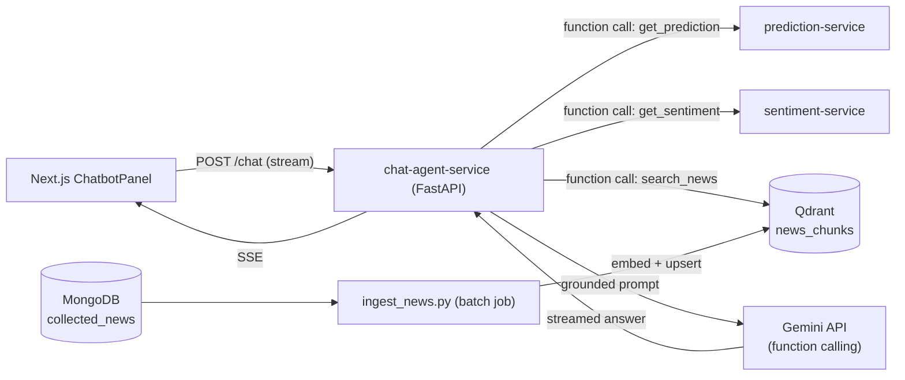

# Improvement Plan — Evaluation Rigor + RAG/Agent Upgrade

> **Status:** Proposal
> **Scope:** Deliberately small. 5 workstreams, each independently shippable and demoable end-to-end. No new frameworks beyond what's already in the stack (Qdrant + a training/serving pair for the distilled sentiment model are the only new pieces of infra).

---

## Goals

The platform already has solid systems architecture (9 services, RabbitMQ, WebSocket gateway) and working AI features (LSTM forecasting, Gemini sentiment/chat). What's missing is **evidence**: no eval numbers for the ML model, no ground-truth check for the LLM sentiment pipeline, no owned model behind the sentiment feature (every call is a third-party API), and the chatbot is a single prompt with no retrieval or tool use. This plan closes those four gaps plus adds a minimal CI safety net — nothing else.

## Guiding principles

- **No new orchestration frameworks** (no LangChain/LlamaIndex). Call the Gemini SDK and Qdrant client directly — fewer moving parts, and every piece is explainable in a review.
- **Every workstream ends in something runnable and demoable**, not just code that compiles. Each section below has a "Definition of done" you can literally screen-record.
- **Reuse existing data and services.** No new data collection pipelines — workstream 3 trains on labels the existing scheduler is already writing to MongoDB. No new ports to memorize, no rewriting the frontend beyond one panel.
- **Smallest version first.** Each workstream lists a "cut here if short on time" line.

## Priority overview

| # | Workstream | Touches | Effort | Payoff |
|---|---|---|---|---|
| 1 | LSTM evaluation harness | `prediction-service` | ~0.5–1 day | Turns "trained an LSTM" into a number you can defend |
| 2 | Sentiment ground-truth eval | `sentiment-service` | ~0.5–1 day | Replaces "it uses Gemini" with a measured accuracy |
| 3 | RoBERTa sentiment distillation (Gemini → local model) | `sentiment-service` | ~3–4 days (+ passive data-collection time) | Turns "calls Gemini" into an actual fine-tuned model with LoRA, cost/latency numbers, and a teacher-student eval |
| 4 | RAG + tool-calling market agent | new `chat-agent-service`, Qdrant, `apps/web` | ~3–5 days | The flagship E2E feature — retrieval, grounding, function calling |
| 5 | Minimal CI | `.github/workflows/`, 2 services | ~0.5–1 day | Baseline engineering hygiene, cheap to add |

Do them in this order. 1 and 2 are cheap and de-risk the resume claims immediately; 3 needs lead time (see below) so kick off its data collection early even if you build it later; 4 is the centerpiece and should get the most polish; 5 is a small addition once the others exist so there's something worth testing.

---

## 1. LSTM evaluation harness

**Problem:** `notebook/train_v3.ipynb` prints a single test-set RMSE from one run and stops. There's no comparison to a baseline, no directional accuracy (does it get the up/down call right, which is what the BUY/SELL/HOLD signal actually depends on), and no artifact to point to.

**Scope:** One script, run against the existing trained checkpoint. No retraining, no architecture changes.

**Implementation**

1. Add `services/prediction-service/app/ml/evaluate.py`:
   - Load the existing checkpoint via `ModelManager.load_model()`.
   - Rebuild the same test split used in `train_v3.ipynb` (or re-run feature engineering on held-out candles).
   - Compute:
     - RMSE / MAE on log-return predictions (and reconstructed price).
     - **Directional accuracy**: `% of predictions where sign(pred_log_return) == sign(actual_log_return)`.
     - Naive baseline for comparison: predict `0` log-return (i.e., "no change") and a persistence baseline (`pred = last observed return`). Directional accuracy above ~50–55% against these baselines is the number worth citing.
   - Write results to `services/prediction-service/eval/report.json` + a short `report.md` table.
2. Optional: a matplotlib plot of predicted vs. actual price over the test window, saved as PNG — good for a portfolio screenshot, not required for the metric itself.

**Definition of done:** running `python -m app.ml.evaluate` prints/saves a table like:

```
Model              RMSE (log-ret)   MAE     Directional Acc.
Naive (0-change)   0.0142           0.0098  50.1%
Persistence        0.0139           0.0095  48.7%
LSTM (ours)        0.0107           0.0071  58.3%
```

**Cut here if short on time:** skip the plot, keep just RMSE + directional accuracy vs. the naive baseline. That alone is enough to back a resume claim.

---

## 2. Sentiment pipeline ground-truth evaluation

**Problem:** The sentiment pipeline is a Gemini prompt with no accuracy measurement — there's no way to say "it's right X% of the time" without a labeled set.

**Scope:** Small, static eval set. No fine-tuning, no new model.

**Implementation**

1. Pull ~40–60 real articles already sitting in the `collected_news` MongoDB collection (covers a range of obviously bullish / bearish / neutral headlines — pick a mix on purpose, don't just take the most recent N).
2. Hand-label each with `sentiment_bucket` (`bullish` / `neutral` / `bearish`, i.e. sentiment score bucketed, not the exact float) and `emotion` — this is fast because you're the domain expert reading crypto headlines, ~1 hour for 50 items.
3. Store as `services/sentiment-service/eval/labeled_set.jsonl` (one JSON object per line: `title`, `content`, `label_sentiment_bucket`, `label_emotion`).
4. Add `services/sentiment-service/eval/evaluate.py`:
   - Runs `SentimentService._analyze_sentiment()` (the real Gemini path, `use_mock_llm=False`) over the labeled set.
   - Buckets the model's continuous score the same way (`> 0.2` → bullish, `< -0.2` → bearish, else neutral).
   - Reports: bucket accuracy, emotion-label accuracy, confusion matrix (bucket vs. bucket).
5. Save `services/sentiment-service/eval/report.md` with the numbers + 3–5 worst-disagreement examples (useful for explaining pipeline limitations in an interview — showing you looked at failure cases is itself a signal).

**Definition of done:** `python -m eval.evaluate` outputs bucket accuracy (e.g., "84% sentiment-bucket agreement, 71% emotion agreement on 50 hand-labeled articles") and a saved confusion matrix.

**Cut here if short on time:** 30 labeled examples instead of 50–60, skip the emotion confusion matrix, keep only sentiment-bucket accuracy.

---

## 3. RoBERTa sentiment distillation (Gemini teacher → local student)

**Problem:** Every sentiment call is a live Gemini API request — rate-limited, costs money per call, and adds ~1–2s latency per article. There's also no *owned* model anywhere in the AI story: the whole pipeline is prompting a third-party API. Meanwhile the scheduler in `collector_scheduler.py` has been writing `{title, content} → {sentiment, emotion, reason}` into the `sentiments` collection every 5 minutes since the service went live — that's a labeled dataset accumulating for free that nobody is using.

**Scope:** Classic teacher-student distillation. Gemini is the teacher (already deployed, already labeling). Fine-tune a small encoder as the student with LoRA, evaluate it against the teacher's labels, and — if it holds up — let `sentiment-service` call it instead of the API for the common case. No RLHF, no training a model from scratch, no multi-GPU anything.

**A note before starting:** Google's API terms restrict using Gemini outputs to train a *competing* general-purpose model. Using your own app's outputs as weak-supervision labels for a narrow, internal sentiment classifier is a different thing, but **read the current ToS yourself before writing this into a report as-is**. The lower-risk version, which is also the more defensible ML story: start from a model already fine-tuned on a public financial-sentiment corpus (Financial PhraseBank or FiQA — both on Hugging Face) and use the Gemini-labeled data for a **domain-adaptation** pass on top, rather than training purely on Gemini's outputs. "Public financial-sentiment base + domain-adapted on labels generated inside the system" is both safer and a better sentence to say in an interview than "distilled from Gemini."

**Implementation**

1. **Export the training set** — `services/sentiment-service/eval/export_training_data.py`: pull all documents from the `sentiments` collection (excluding whatever ended up in workstream 2's hand-labeled eval set, so eval stays clean), output `(title + content, sentiment_score, emotion)` triples as a parquet/JSONL file. Volume is whatever has accumulated — even a few hundred to a few thousand rows is workable for a LoRA adapter; there's no need to wait for tens of thousands.
2. **Base model** — `distilroberta-base` or a public financial-sentiment checkpoint (e.g. a Financial PhraseBank–tuned RoBERTa from the Hub) as the starting point, per the note above.
3. **Fine-tune with LoRA** (`peft` + `transformers`) — `services/sentiment-service/training/train_distill.py`:
   - Two small heads: a regression head for the continuous `-1..+1` sentiment score, a classification head for the 6 emotion classes.
   - LoRA adapters only (rank 8–16) on the attention layers, base weights frozen — this is what makes it a "few minutes on a free Colab GPU" job instead of a multi-hour one, and it's the concrete number ("LoRA cut trainable params to X%, training memory to Y%") that backs the resume claim.
   - Train/val split by time (older data trains, newest slice validates) to avoid leaking near-duplicate headlines across the split.
4. **Evaluate against the teacher** — `services/sentiment-service/training/evaluate_distill.py`:
   - Spearman correlation + MAE between student and Gemini scores on held-out data.
   - Emotion-label accuracy (student vs. Gemini label).
   - **The number that actually matters:** re-run workstream 2's hand-labeled eval set through the student model too, so you have student-vs-human accuracy sitting right next to Gemini-vs-human accuracy in the same report — that's the honest "how much quality did we trade for speed/cost" answer.
5. **(Stretch) Wire it in** — add `SENTIMENT_BACKEND=gemini|local` to `sentiment-service` config; when `local`, run the student model (CPU, ONNX or plain `transformers` inference) instead of calling the API. Keep Gemini as the fallback/default so nothing breaks if the student underperforms.

**Definition of done:** a `services/sentiment-service/training/report.md` showing, side by side: Gemini-vs-human accuracy (from workstream 2) and student-vs-human accuracy on the *same* hand-labeled set, plus student-vs-Gemini Spearman/MAE, plus one concrete latency/cost comparison (Gemini API round-trip time & $/1k articles vs. local CPU inference time & $0).

**Cut here if short on time:** skip step 5 (wiring it into the live service) entirely — a trained adapter with an honest eval report is already a legitimate "fine-tuned RoBERTa with LoRA" artifact even if `sentiment-service` keeps calling Gemini in production. Drop the emotion head first if the regression head alone is taking too long to get right.

---

## 4. RAG + tool-calling market agent (flagship, e2e)

**Problem:** `apps/web/app/api/chatbot/route.ts` is a single system prompt with `symbol` + `currentPrice` string-interpolated in. It can't ground answers in real news, can't pull live prediction/sentiment numbers itself, and there's no retrieval happening anywhere.

**Scope:** One new backend service owns retrieval + tool orchestration. The frontend calls that service instead of calling Gemini directly. No multi-turn memory store, no reranking, no hybrid search — the simplest version of each piece.

### Architecture



### Components

**a. Qdrant** — add to `docker-compose.dev.yml` as a standard service (official `qdrant/qdrant` image, one volume mount). One collection: `news_chunks`.

**b. Ingestion script** — `services/chat-agent-service/scripts/ingest_news.py`:
   - Reads `collected_news` from MongoDB (already populated by the existing collectors — no new data source).
   - Chunk = one article (title + first ~500 tokens of content). No sliding-window chunking needed at this article length.
   - Embed with Gemini's `embedding-001` (or any single embedding call — keep it to one provider, don't add a second API).
   - Upsert into Qdrant with payload `{symbol, title, link, published_at}`.
   - Run as a one-off script first, then optionally hook into the existing `collector_scheduler.py` cadence later — **not required for v1**.

**c. Tool definitions** (native Gemini function calling, no framework):

| Tool | Calls | Purpose |
|---|---|---|
| `get_prediction(symbol)` | `GET prediction-service/api/predictions/predict` | Live BUY/SELL/HOLD + predicted price |
| `get_sentiment_summary(symbol)` | `GET sentiment-service/sentiments/symbol/{symbol}/average` | Aggregate sentiment over last 24h |
| `search_news(query, symbol?)` | Qdrant top-k (k=5) on `news_chunks` | Grounds answers in real articles instead of the model's own (possibly stale/hallucinated) knowledge |

**d. Agent loop** — `services/chat-agent-service/app/agent.py`:
   1. Send user message + tool schemas to Gemini.
   2. If Gemini returns a function call, execute it (HTTP call or Qdrant query), feed the result back as a function response.
   3. Repeat until Gemini returns a final text answer (cap at 3 tool-call rounds to avoid loops).
   4. Stream the final answer back over SSE — same wire format the frontend already expects, so `ChatbotPanel.tsx` barely changes.

**e. Frontend change** — `apps/web/app/api/chatbot/route.ts` becomes a thin proxy to `chat-agent-service`'s `/chat` endpoint instead of calling `GoogleGenerativeAI` directly. `ChatbotPanel.tsx` itself shouldn't need changes since the SSE contract stays the same.

### Definition of done (this is the demo)

Ask the chatbot: *"What's the sentiment on ETH right now and is now a good time to look at it?"* and confirm in the response (or in server logs / a debug panel) that it:
1. Called `get_sentiment_summary("ETHUSDT")` and `get_prediction("ETHUSDT")`,
2. Called `search_news` and cited/paraphrased an actual retrieved headline,
3. Produced one coherent grounded answer, streamed.

That's the whole story for an AI Engineer interview: retrieval, grounding, tool use, in a system you can trace end-to-end.

**Cut here if short on time:** drop `search_news`/Qdrant first (keep just the two service-calling tools — still legitimate function calling) if the week is tight, then add retrieval back once the tool-calling loop works. Full RAG is the stretch goal, not the floor.

---

## 5. Minimal CI

**Problem:** No CI at all currently. Doesn't need to be comprehensive — just prove the habit exists.

**Scope:** One workflow file, two services, lint + unit tests only. Not every service, not e2e tests in CI.

**Implementation**

`.github/workflows/ci.yml`:
- Job 1: `prediction-service` — `ruff check` + `pytest` (add 3–5 unit tests: feature calculation functions in `TechnicalIndicatorCalculator` are pure functions and trivial to test without a live model).
- Job 2: one NestJS service (`api-gateway` or `user-service`) — `eslint` + `jest` (whatever tests already exist, or add a couple for the auth guards).
- Trigger: on PR to `main`.

**Definition of done:** a badge in the root `README.md` and a green run on the next PR.

**Cut here if short on time:** lint-only, no test job, if writing new tests isn't worth the time this week.

---

## Explicitly out of scope

- LangChain / LlamaIndex — see prior discussion, adds abstraction without adding capability at this scale.
- Multi-symbol LSTM retraining / generalizing the model beyond BTCUSDT — nice-to-have, not worth the training time for the payoff.
- Fine-tuning a full LLM (Gemini or otherwise) for the chatbot — market knowledge changes daily, and freezing it into fine-tuned weights is the wrong tool; that's what workstream 4 (RAG) is for. Workstream 3's RoBERTa distillation is a different, narrower thing (a small encoder for a fixed classification task) and doesn't have this problem.
- Rewriting the frontend beyond the one chatbot proxy change.
- Auth/memory/multi-turn state for the agent — single-turn tool calling is enough to demonstrate the pattern.

## Suggested order

1. Workstream 1 (LSTM eval) — cheapest, do first.
2. Workstream 2 (sentiment eval) — same day or next, independent of everything else. Its labeled set is reused by workstream 3's final eval, so do it first.
3. Workstream 3 (RoBERTa distillation) — start the data export early since more accumulated Gemini labels only helps; the actual training/eval work can slot in whenever.
4. Workstream 4 (RAG agent) — the main effort, budget the most time here.
5. Workstream 5 (CI) — last, once there's something worth gating.
