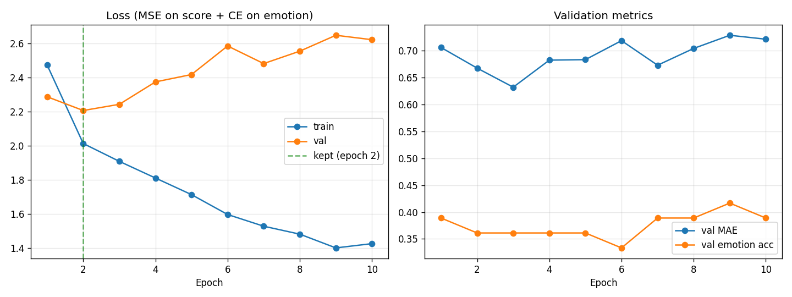

# Sentiment Student — LoRA Training Run

> Generated by `python -m training.train_distill` on 2026-08-18T07:36:20+00:00.

## ⚠ Data provenance

**176 of 176 training rows carry labels from the keyword fallback in `SentimentService._mock_sentiment_analysis`, not from Gemini.** This run therefore validates the training pipeline; it does not produce a distilled LLM. See `training/data/export_report.md` for how to fix the labels and re-run.

## Setup

- **Base checkpoint:** `mrm8488/distilroberta-finetuned-financial-news-sentiment-analysis`
  (already fine-tuned on a public financial-sentiment corpus; this run is a domain-adaptation pass on top, not training from scratch)
- **LoRA:** rank 16, alpha 32, dropout 0.05, targeting `query`, `value`
- **Heads:** regression (1 output, tanh to -1..+1) + emotion (6-way classification)
- **Schedule:** 10 epochs, batch 8, lr 0.0003, 10% warmup
- **Data:** 140 train / 36 val rows, split chronologically
- **Device:** cpu

## What LoRA bought

| | Params |
|---|---|
| Full model | 82,418,695 |
| Trainable (LoRA + heads) | 300,295 |
| &nbsp;&nbsp;of which LoRA adapters | 294,912 |
| &nbsp;&nbsp;of which task heads | 5,383 |
| **Trainable share** | **0.36%** |

The frozen base encoder keeps 82,118,400 parameters fixed, so only 0.36% of the model receives gradients. That is what makes this a CPU-minutes job instead of a GPU-hours one.

## Training curve

| Epoch | Train loss | Val loss | Val MAE | Val emotion acc. | |
|---|---|---|---|---|---|
| 1 | 2.4721 | 2.2866 | 0.7060 | 38.9% | |
| 2 | 2.0127 | 2.2060 | 0.6676 | 36.1% | **← kept** |
| 3 | 1.9083 | 2.2423 | 0.6322 | 36.1% | |
| 4 | 1.8108 | 2.3735 | 0.6825 | 36.1% | |
| 5 | 1.7135 | 2.4167 | 0.6834 | 36.1% | |
| 6 | 1.5971 | 2.5840 | 0.7187 | 33.3% | |
| 7 | 1.5285 | 2.4809 | 0.6730 | 38.9% | |
| 8 | 1.4821 | 2.5535 | 0.7042 | 38.9% | |
| 9 | 1.4015 | 2.6466 | 0.7287 | 41.7% | |
| 10 | 1.4265 | 2.6207 | 0.7214 | 38.9% | |

Training loss keeps falling to epoch 10 while validation loss bottoms at epoch 2 — the run overfits, which is what 140 training rows buys you. The saved adapter is the epoch-2 checkpoint, not the last one.



## Saved checkpoint

| Metric | Selected (epoch 2) | Last epoch (10) |
|---|---|---|
| Val loss | **2.2060** | 2.6207 |
| Val MAE (sentiment score) | **0.6676** | 0.7214 |
| Val emotion accuracy | **36.1%** | 38.9% |
| Val Spearman (student vs teacher) | **0.172** | 0.165 |

Emotion accuracy is against a 16.7% random baseline over 6 classes.

These are student-vs-teacher numbers on held-out rows. The number that actually matters — student vs. human on the workstream-2 labelled set — is Sprint 2's job (`training/evaluate_distill.py`).

## Artifacts

- `training/artifacts/lora_adapter` — lora adapter
- `training/artifacts/heads.pt` — heads
- `training/artifacts/loss_curve.png` — loss curve

## Reproducing

```bash
cd services/sentiment-service
pip install -r training/requirements.txt
python -m eval.export_training_data --allow-mock-labels
python -m training.train_distill
```
